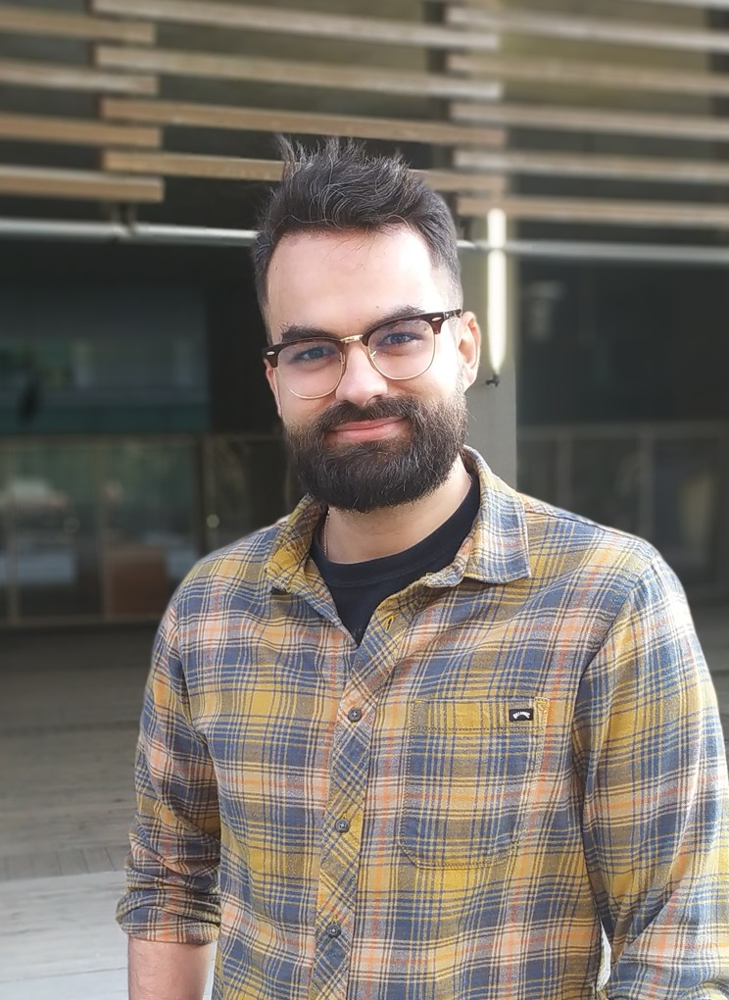

# Samuel Miravet-Verde personal page

### Research 

<!---

-->

I am a **computational biologist** specializing in **microbiology** and **artificial intelligence–driven bioinformatics** to investigate the genomic and functional complexity of microbial life.  

During my PhD at the Centre for Genomic Regulation in [**Serrano Lab**](http://serranolab.crg.eu/), I led research demonstrating that **small proteins play roles as crucial as larger proteins in microbial systems**, developing multiple tools to study them and addressing other challenges such as **assessing gene essentiality**. I also served as the main data analyst in several collaborative projects, contributing to diverse microbiological studies.  

In 2022, I joined the [**Sunagawa Lab**](https://micro.biol.ethz.ch/research/sunagawa.html) as a postdoctoral researcher at ETH Zurich, where I led the development of the [**Ocean Microbiome Database** (OMDB)](https://omdb.microbiomics.io/repository/ocean/) — the largest curated resource of marine microbial genomes. This work laid the foundation for my **Human Frontiers Science Program (HFSP) Long-Term Postdoctoral Fellowship**, under the project *[Charting the Origin, Diversity, and Biogeography of Small Proteins in the Global Ocean Microbiome](https://www.hfsp.org/awardees/awards?field_award_type_target_id=92&field_award_year_target_id%5B%5D=399&field_countries_target_id=SWITZERLAND&field_nationalities_target_id=SPAIN+%28310%29)*.

## Experience

<strong>Professional and Academic Experience</strong>

- **2022 – Present** — *HFSP Long-Term Postdoctoral Fellow*, [Sunagawa Lab](https://www.sunagawa.ethz.ch), ETH Zurich — Zurich, Switzerland  
  Leading the *Ocean Microbiome Database* project and research on small proteins in marine microbiomes.

- **2022 – 2023** — *Postdoctoral Researcher*, [Sunagawa Lab](https://www.sunagawa.ethz.ch), ETH Zurich — Zurich, Switzerland

- **2021 – 2022** — *Junior Postdoctoral Researcher*, [Centre for Genomic Regulation (CRG)](http://serranolab.crg.eu/) — Barcelona, Spain

- **2017  – 2017** — *Visiting PhD Student*, [Karr Lab](https://karrlab.org), Icahn Institute for Data Science and Genomic Technology — New York, USA

- **2016 – 2021** — *PhD in Biomedicine & Computational Biology*, Serrano Lab, [Centre for Genomic Regulation (CRG)](http://serranolab.crg.eu/) — Barcelona, Spain

- **2015 – 2016** — *Bioinformatics Intern*, Serrano Lab, [Centre for Genomic Regulation (CRG)](http://serranolab.crg.eu/) — Barcelona, Spain

- **2013 – 2014** — *Bioinformatics Intern*, GEM Biosoft — Valencia, Spain

- **2013 – 2014** — *Bioinformatics Intern*, Foundation for the Promotion of Health and Biomedical Research — Valencia, Spain

- **2011 – 2013** — *Research Intern*, Foundation for the Promotion of Health and Biomedical Research — Valencia, Spain

<strong>Other Experience</strong>

- **Nov 2022 – Present** — *Teaching Fellow*, ETH Zurich — Zurich, Switzerland. Planning, preparation, teaching, and evaluation for the block course **Microbial Community Genomics** (551-1119-00L), covering theoretical, practical, and project development aspects of bioinformatics applied to microbiome research (3 editions).

- **2023 – Present** — *Editorial Board Member*, BMC Bioinformatics. Since June 2024 also *Early Career Reviewer*, Blue Biotechnology

## Education

- **Oct 2016 – May 2021** — *PhD in Biomedicine and Computational Biology*, Universitat Pompeu Fabra — Barcelona, Spain. Grade: Excellent cum laude - International mention
- **Sep 2014 – Jun 2016** — *MSc in Bioinformatics for Health Sciences*, Universitat Pompeu Fabra / Universitat de Barcelona — Barcelona, Spain. Grade: 9.45, 125 ECTS. 
- **Sep 2010 – Jun 2014** — *BSc in Biochemistry and Biomedical Sciences*, Universitat de València — Valencia, Spain. Grade: 8.37, 244.5 ECTS

### Publications

<strong>First-author papers</strong>

- "**The natural diversity of *E. coli* transporter-dependent capsules**" — Carine Roese Mores, Samuel Miravet-Verde, ..., Shinichi Sunagawa, Timothy G. Keys. *bioRxiv*, 2025 (07 Aug 2025). [📄 Link](https://doi.org/10.1101/2025.08.07.669119)

- "**Quantitative essentiality in a reduced genome: a functional, regulatory and structural fitness map**" — Samuel Miravet-Verde, Raul Burgos, ..., Luis Serrano. *bioRxiv*, 2025 (06 Feb 2025). [📄 Link](https://doi.org/10.1101/2025.02.06.636790)

- "**ProTInSeq: transposon insertion tracking by ultra-deep DNA sequencing to identify translated large and small ORFs**" — Samuel Miravet-Verde, Riccardo Mazzolini, ..., Maria Lluch-Senar, Luis Serrano. *Nature Communications*, 2024 (12 Feb 2024). [📄 Link](https://www.nature.com/articles/s41467-024-46112-2)

- "**FASTQINS and ANUBIS: two bioinformatic tools to explore facts and artifacts in transposon sequencing and essentiality studies**" — Samuel Miravet-Verde, Raul Burgos, ..., Maria Lluch-Senar, Luis Serrano. *Nucleic Acids Research*, 2020 (21 Sep 2020). [📄 Link](https://academic.oup.com/nar/article/48/17/e102/5894413)

- "**Unraveling the hidden universe of small proteins in bacterial genomes**" — Samuel Miravet-Verde, Toni Ferrar, ..., Luis Serrano, Maria Lluch-Senar. *Molecular Systems Biology*, 2019 (20 Feb 2019). [📄 Link](https://www.embopress.org/doi/full/10.15252/msb.20188290)

- "**Alternative transcriptional regulation in genome-reduced bacteria**" — Samuel Miravet-Verde, Victor Lloréns-Rico, Luis Serrano. *Current Opinion in Microbiology*, 2017 (Oct 2017). [📄 Link](https://www.sciencedirect.com/science/article/pii/S1369527417300723)

<strong>Main data analyst</strong>

- "**SURE editing: combining oligo-recombineering and programmable insertion/deletion of selection markers to efficiently edit the *Mycoplasma pneumoniae* genome**" — Carlos Piñero-Lambea, Eva Garcia-Ramallo, Samuel Miravet-Verde, ..., Maria Lluch-Senar, Luis Serrano. *Nucleic Acids Research*, 2022 (15 Dec 2022). [📄 Link](https://doi.org/10.1093/nar/gkac1132)

- "**LoxTnSeq: random transposon insertions combined with cre/lox recombination and counterselection to generate large random genome reductions**" — Daniel Shaw, Samuel Miravet-Verde, ..., Maria Lluch-Senar, Luis Serrano. *Microbial Biotechnology*, 2021 (Nov 2021). [📄 Link](https://doi.org/10.1111/1751-7915.13894)

- "**Inferring active metabolic pathways from proteomics and essentiality data**" — Adrián Montero-Blay, Samuel Miravet-Verde, ..., Maria Lluch-Senar, Luis Serrano. *Cell Reports*, 2020 (02 Jun 2020). [📄 Link](https://doi.org/10.1016/j.celrep.2020.107722)

- "**SynMyco transposon: engineering transposon vectors for efficient transformation of minimal genomes**" — Adrián Montero-Blay, Samuel Miravet-Verde, ..., Maria Lluch-Senar, Luis Serrano. *DNA Research*, 2019 (01 Aug 2019). [📄 Link](https://doi.org/10.1093/dnares/dsz015)

<strong>Supervisor</strong>

- "**Using single-cell perturbation screens to decode the regulatory architecture of splicing factor programs**" — Miquel Anglada-Girotto, Samuel Miravet-Verde, Luis Serrano. *bioRxiv*, 2025 (07 Feb 2025). [📄 Link](https://doi.org/10.1101/2025.02.07.637061)

- "**Exon inclusion signatures enable accurate estimation of splicing factor activity**" — Miquel Anglada-Girotto, Daniel F. Moakley, ..., Samuel Miravet-Verde, ..., Luis Serrano. *Nature Communications*, 2024 (25 Mar 2024). [📄 Link](https://pmc.ncbi.nlm.nih.gov/articles/PMC11230296/)

- "**In silico RNA isoform screening to identify potential cancer driver exons with therapeutic applications**" — Miquel Anglada-Girotto, Laura Ciampi, ..., Samuel Miravet-Verde, ..., Luis Serrano. *Nature Communications*, 2024 (26 Dec 2024). [📄 Link](https://doi.org/10.1038/s41467-024-44468-7)

- "**robustica: customizable robust independent component analysis**" — Miquel Anglada-Girotto, Samuel Miravet-Verde, ..., Stephen A. Head. *BMC Bioinformatics*, 2022 (16 Aug 2022). [📄 Link](https://doi.org/10.1186/s12859-022-04847-6)

<strong>Other collaborations</strong>

- "**Genome-resolved diversity and biosynthetic potential of the coral reef microbiome**" — Lucas Paoli, Fabienne Wiederkehr, ..., Samuel Miravet-Verde, ..., Shinichi Sunagawa. *bioRxiv*, 2024 (18 Aug 2024). [📄 Link](https://doi.org/10.1101/2024.08.18.608444)

- "**Extensive data mining uncovers novel diversity among members of the rare biosphere within the Thermoplasmatota**" — Mara D. Maeke, Xiuran Yin, ..., Samuel Miravet-Verde, ..., Christiane Hassenrück. *Microbiome*, 2025 (03 Aug 2025). [📄 Link](https://microbiomejournal.biomedcentral.com/articles/10.1186/s40168-025-02140-8)

- "**The mOTUs online database provides web-accessible genomic context to taxonomic profiling of microbial communities**" — Marija Dmitrijeva, Hans-Joachim Ruscheweyh, ..., Samuel Miravet-Verde, ..., Shinichi Sunagawa. *Nucleic Acids Research*, 2025 (06 Jan 2025). [📄 Link](https://academic.oup.com/nar/article/53/D1/D797/7889250?login=true)

- "**Engineering *Mycoplasma pneumoniae* to bypass the association with Guillain-Barré syndrome**" — Alicia Broto, Carlos Piñero-Lambea, ..., Samuel Miravet-Verde, ..., Luis Serrano. *Microbes and Infection*, 2024 (15 Jul 2024). [📄 Link](https://doi.org/10.1016/j.micinf.2024.105342)

- "**Specialization of the photoreceptor transcriptome by Srrm3-dependent microexons is required for outer segment maintenance and vision**" — Laura Ciampi, Federica Mantica, ..., Samuel Miravet-Verde, ..., Manuel Irimia. *PNAS*, 2022 (19 Jul 2022). [📄 Link](https://doi.org/10.1073/pnas.2117090119)

- "**A genetic toolkit and gene switches to limit *Mycoplasma* growth for biosafety applications**" — Alicia Broto, Emanuele Gaspari, Samuel Miravet-Verde, ..., Luis Serrano. *Nature Communications*, 2022 (08 Apr 2022). [📄 Link](https://doi.org/10.1038/s41467-022-29529-4)

- "**The role of clonal communication and heterogeneity in breast cancer**" — Ana Martín-Pardillos, Ángela Valls Chiva, ..., Samuel Miravet-Verde, ..., Santiago Ramón y Cajal. *BMC Cancer*, 2019 (10 Jul 2019). [📄 Link](https://doi.org/10.1186/s12885-019-5840-6)

- "**High frequencies of antibiotic resistance genes in infants' meconium and early fecal samples**" — Maria José Gosalbes, Yolanda Vallès, ..., Samuel Miravet-Verde, ..., Maria Pilar Francino. *Journal of Developmental Origins of Health and Disease*, 2016 (06 Feb 2016). [📄 Link](https://doi.org/10.1017/S2040174415007832)

- "**Engineering bacteria to form a biofilm and induce clumping in *Caenorhabditis elegans***" — Pablo Dorado-Morales, Antonio Iglesias, ..., Samuel Miravet-Verde, ..., Manuel Porcar. *ACS Synthetic Biology*, 2014 (15 Dec 2014). [📄 Link](https://doi.org/10.1021/sb500039k)

